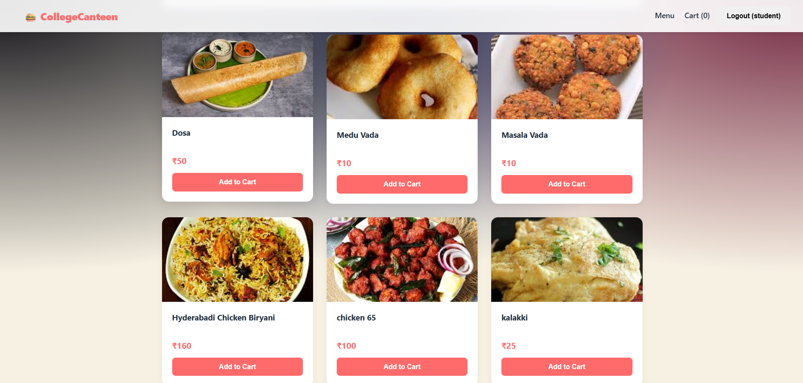
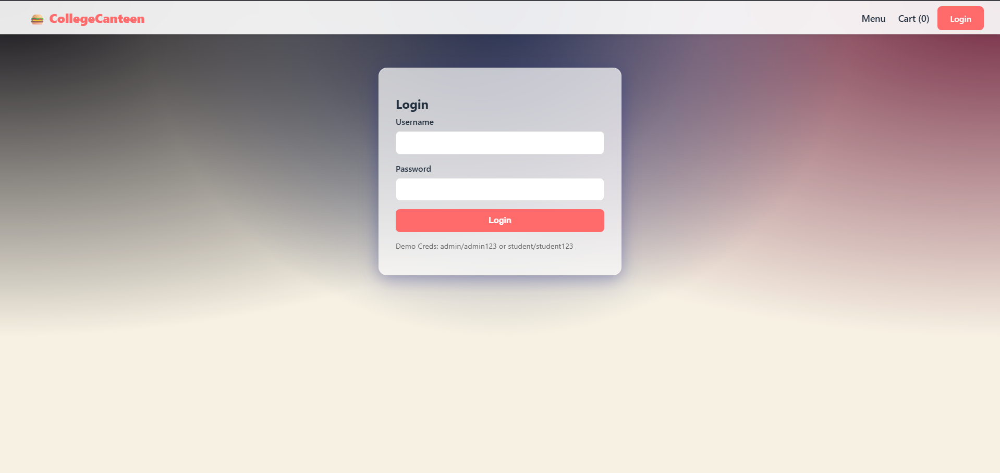
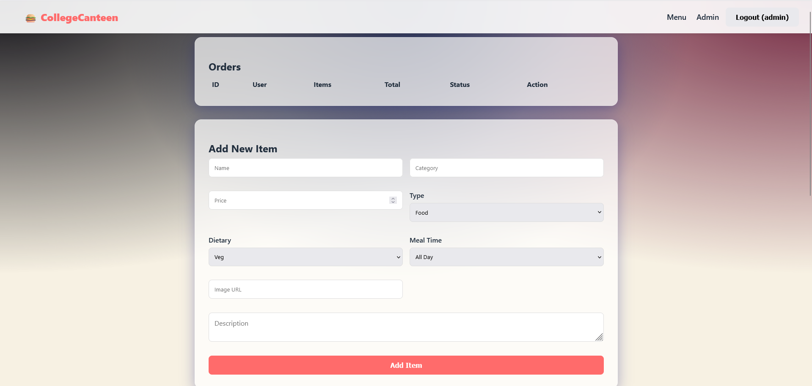
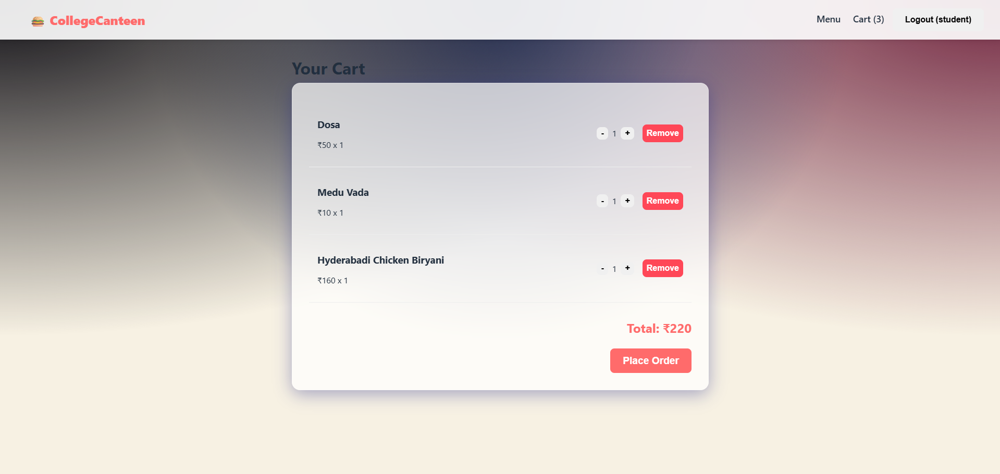

# Canteen Ordering Platform 🍔

A full-stack web application for college canteens enabling students to browse the menu, filter items, and place orders, while administrators manage the menu and process orders.

## Features
- **User Role (Student)**:
    - Browse menu (Food/Drinks).
    - Filter by Type (Veg/Non-Veg) and Meal Time (Breakfast/Lunch/All).
    - Add items to Cart.
    - Place Orders.
- **Admin Role**:
    - Manage Menu (Add/Delete Items).
    - View Orders with detailed Item lists.
    - Update Order Status (Pending -> Completed).

## Tech Stack
- **Frontend**: React + Vite (Javascript)
- **Backend**: Flask (Python)
- **Database**: SQLite
- **Styling**: Custom CSS (Glassmorphism design)

## Screenshots
### Home / Menu Page


### Login Page


### Admin Dashboard


### Cart


## Installation & Setup

### 1. Backend
```bash
# Navigate to backend directory (or root)
cd backend
# Install dependencies
pip install -r requirements.txt
# Run server (runs on port 5000)
python app.py
```

### 2. Frontend
```bash
# Navigate to frontend directory
cd frontend
# Install dependencies
npm install
# Run dev server (runs on port 5173)
npm run dev
```

## Usage
- **Admin Login**: `admin` / `admin123`
- **Student Login**: `student` / `student123`

## License
MIT
